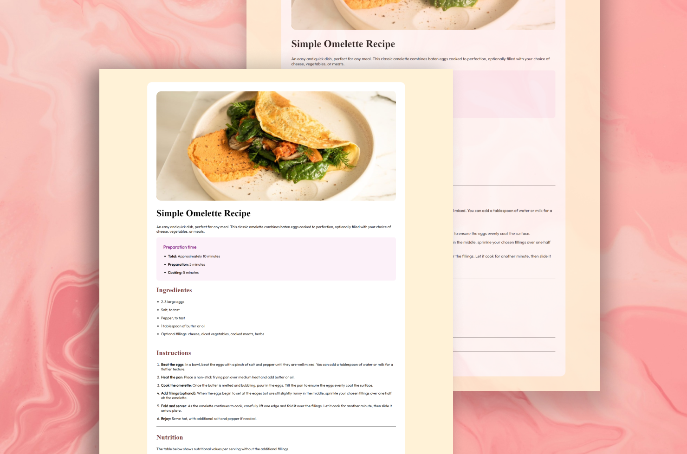

<h1 align="center"> Omelette 🍳</h1>

 Projeto bem simples para treinar minhas habilidades em HTML e CSS

## Tecnologias utilizadas:

✔️ HTML e CSS

✔️ Figma

✔️ Git e GitHub

## Visualização do projeto 🔎:

✔️ [Acesse o projeto finalizado, online](https://ashcoelho.github.io/Omelette-Resipe/) 😄

